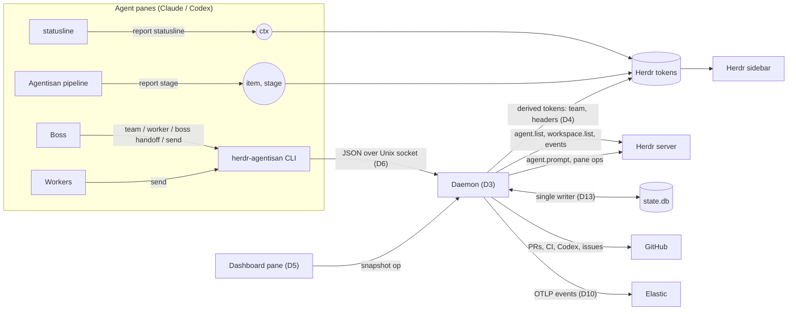

# ADR-001: herdr-agentisan — boss-led workflow plugin for Herdr

Oct 9, 2026 · @abanna

herdr-agentisan is a Go CLI and daemon, packaged as a Herdr plugin, that executes and observes a boss-led Agentisan workflow. The boss keeps every workflow decision. The plugin owns lifecycle, observation, presentation and durability.

## Status and metadata

| Field | Value |
| --- | --- |
| Status | Accepted 2026-10-09, with amendments A1 to A14 (see [Amendments](#amendments)). Where an amendment and the text above it disagree, the amendment wins |
| Deciders | Alexander Banna |
| Design issue | NERD-5244 |
| Build project | P-NERD-16 |
| Baseline | Phase 1 merged: NERD-5240 to 5243, PRs #4 to #7, main at fc5cf7a |
| Supersedes | DR 001 draft, 2026-10-09 |
| Herdr version | Pinned per D2; facts verified against herdr src at v0.9.3 |

Each decision carries an ID (D1 to D12). A later ADR may supersede a single decision, for example "supersedes ADR-001 D7", without reopening the rest.

## Context

The workflow works, but it is held together by untested scripts that fight each other. Nothing supervises it, and it cannot be reused on another project.

Today a boss agent backed by Agentisan directs specialist workers in Herdr. The groups are coders, precheck, QA, Codex review triage, research, clerk and debugger. Workers take direction from the boss. The boss and workers hand off and reload at 55 to 65 percent context usage.

The pieces that hold it together:

- herdr-dashboard-v12.py renders the team dashboard and pushes sidebar tokens.
- herdr-status.sh builds the PR, CI, Codex and issue header.
- hs.sh reports item and stage.
- dashboard-tab.sh opens the dashboard tab.
- A pkill herdr agent attach workaround is bound to prefix+b as a back key.
- btop runs on a popup key.

### Problems this ADR solves

1. Two pushers writing the same token key overwrite each other, because the last write wins.
2. Context rotation depends on someone noticing the percentage. No process watches it.
3. Nothing supervises long-running work. A startup hook runs once and is never restarted.
4. Shell and Python cannot be tested at the behavior level, and every handoff invariant lives there.
5. Paths, worker counts and commands are hard-coded, so a second project means copying the scripts.

### Goals

- Preserve today's behavior, with the boss in charge of the workflow and of the team.
- On request, the boss builds out its team, adds and removes workers based on load and context, and hands its own session to a new boss.
- Make the workflow reusable across projects through configuration alone.
- Make context rotation lossless for the boss and for workers.
- Use Agentisan for every workflow, and tdaddy in every Go project.
- Reach the target wireframe: a left sidebar by project, and per project a boss tab plus seven group tabs (coders, qa, precheck, clerk, research, codex, debugger). The boss tab has the dashboard above the boss terminal.

### Non-goals

- Replacing Agentisan's planning, assignment or review pipeline.
- A general messaging service, or a REST or gRPC API.
- Shipping the target layout first. The plugin is built against today's ~/.config/herdr/config.toml and today's layout of ◆ group spaces plus a boss space. The layout comes last (D5).

## Verified constraints

Every decision below is shaped by these Herdr facts, verified against the herdr source at v0.9.3. Herdr is pre-1.0, so D2 pins the version and the daemon refuses to run against a protocol it has not been verified on.

| Constraint | Detail | Consequence |
| --- | --- | --- |
| Token precedence | Tokens are stored per target by key, and the last write wins across `--source` values (src/metadata_tokens.rs) | Each key has exactly one writer (D4). The Python pusher stops at cutover, key by key |
| Token limits | A value holds 80 characters at most, a report carries 16 keys, and a target holds 32. A missing token removes its line | Token formats are budgeted in the token contract, and expiry is visible |
| Colour rules | `gt` and `lt` rules match only values that parse completely as a number | `$ctx` is a bare integer such as `42`, never `42%` |
| `$team` rules | The rules match on ⚠ and ⟳ | The `$team` format is frozen: `N · ◐w ●i[ ⚠b][ ⟳r]` |
| Startup hooks | `[[startup]]` runs on server start and live handoff only, not on plugin link or enable. Herdr does not supervise it | The daemon needs a manual start action. Verification never restarts the user's server |
| Keybindings | Plugins cannot ship default keybindings | Keys live in the user's config.toml and are applied by `config apply` (D9) |
| Pane identity | `HERDR_PANE_ID` reaches shells under Claude Code (checked: `w14:p1`) | Agents can report their own state (D4) |
| Claude context | `~/.claude/statusline.sh` already reads `.context_window.used_percentage` | The Claude context signal exists today |
| Codex context | No equivalent signal has been verified | Open item: Codex rotation is blocked on a spike |
| Existing code | `plugin.CallTimeout` (5s) is in internal/plugin/ping.go. `herdr.Client.Call` is generic (internal/herdr/herdr.go). `herdrtest.Start` is a fake server | Every herdr call gets a per-call timeout, and every test runs against herdrtest |

## Decision drivers

These drivers break ties between the decisions below, in this order.

1. **The boss owns the workflow and the team.** Every spawn, retire and handoff is a boss command. Agentisan must still work as a single session.
2. **One source of truth for each piece of data.** Each piece of data has one writer, and state comes from the component that knows it rather than being inferred.
3. **Behavior is testable first.** Every invariant has a given/when/then test against herdrtest before code is written.
4. **Boring architecture.** Files and Unix sockets come before services, and polling comes before a protocol, until data shows a gap.
5. **Independent of layout.** Nothing is coupled to the ◆ spaces that the 8-tab layout will replace.
6. **The user's session is never disrupted.** No step restarts the user's Herdr server, and the scripts stay as a pinned fallback until the Go path has proven itself.
7. **The toolchain is mandatory.** Agentisan runs every workflow, and tdaddy is used in every Go project.

## Decisions

Diagram added at acceptance in place of the draft's missing figure. It already reflects amendments A1 (`state.db`) and A2 (any agent sends messages with `send`).

Agents push their own state. The daemon is the only component that polls Herdr and GitHub, writes derived tokens and serves the dashboard. Every workflow decision still goes through the boss.

### D1. The boss owns the team; the daemon executes its commands

The Agentisan boss owns planning, assignment, messaging, blocker resolution, and the size and makeup of its team. It adds, removes and replaces workers at will, based on load and context, and it hands off its own session. The daemon executes those commands (D11) and observes. It never spawns, retires or replaces an agent on its own. At context thresholds it notifies the boss, and at the ceiling it also alerts the user (D7).

*Rationale:* Agentisan is dogfooded and must still work in a single session. A daemon that resized the team itself would become a second orchestrator, and a boss that cannot resize its team cannot respond to load.

### D2. Runtime: a single Go binary behind a Herdr plugin manifest

`herdr-agentisan` is one Go binary. `herdr-plugin.toml` registers its `[[startup]]` hook, `[[actions]]` and `[[panes]]`. `task install` puts the binary on PATH, and `task plugin:link` links the manifest. Prebuilt release assets come later, once there is a second user. The supported Herdr version is pinned in the repo. The daemon reads the server's protocol version at startup and exits with a clear error if it has not been verified.

*Rationale:* Go is chosen for behavioral testability, typed configuration validation and a long-running supervisor. Shell and Python cannot test the handoff invariants with confidence. The existing scripts remain a pinned fallback, and each is retired only when its Go replacement passes the same acceptance tests.

### D3. The daemon is the single collector and the only writer of derived state

One daemon runs per Herdr server. It is a reconcile loop:

- On start, it rebuilds its model from `agent.list`, `workspace.list` and the runtime state files.
- It then polls about every 3 seconds and also subscribes to focus events.
- It is the only writer of derived tokens (D4), of the runtime state files (contracts), and of collected external data such as PRs, CI, Codex review and issues. That data is cached and fetched on its own interval.
- It serves snapshots over its Unix socket (D6). Dashboards read those snapshots and never poll Herdr or GitHub themselves.

Lifecycle:

- `daemon start` spawns a detached `daemon run` with setsid, logs to a size-capped file under `HERDR_PLUGIN_STATE_DIR`, and exits.
- A flock'd lock file enforces a single instance. A second `run` that cannot take the lock exits 0.
- The `[[startup]]` hook calls `daemon start`. The `daemon-restart` action covers linking and manual recovery, because linking does not fire startup hooks.
- The daemon exits when the Herdr socket disappears or its inode changes. The next server start launches a new one.
- A crash costs only the restart, because state is rebuilt on start.

### D4. State is pushed by the component that knows it, and each key has one writer

The agent pushes its own context: `report statusline` sends `$ctx` from Claude's statusline. Agentisan pushes item and stage: `report stage` is called on every pipeline step transition. The daemon pushes anything derived, such as `$team` and any header tokens. No component infers state from working directories or by scraping files. During cutover, the Python pusher stops writing a key in the same change that introduces its new writer.

*Rejected:* mapping each pane's `foreground_cwd` to a `generations/<ticket>/<slug>/gNNN` worktree and reading `.agentisan/state.json`. That breaks when an agent changes directory. It also couples the plugin to a private file layout, and it does not work for Codex.

### D5. Presentation reads a model that is independent of layout

The daemon keeps one domain model: project → group → logical worker → current pane. A target resolver maps the model onto the current layout. Today that means the ◆ group spaces and a boss space. The 8-tab layout later replaces only the resolver.

Presentation components:

- **Dashboard:** a Go bubbletea pane placed with `[[panes]] placement="split"`, rendered from daemon snapshots. Its header shows project colour, PRs with CI, Codex 👍 and merge state, issues, slots, and boss ctx and runtime. Group boxes show each agent's status, model, ctx, item and stage.
- **Jump:** clicking a group box or pressing Enter runs `agent.focus` and zooms the pane.
- **Back:** returns to the previous pane from the daemon's focus history and un-zooms. It replaces the `pkill` workaround on prefix+b.
- **Search:** `/` in the dashboard and prefix+/ anywhere fuzzy-match agents and spaces. Herdr's built-in Go To is evaluated first and used if it is enough.
- **btop:** stays a popup key.

Sidebar grouping through header tokens carried by the first agent in each group is deferred. It breaks when that agent rotates out, and the dashboard may make it unnecessary.

### D6. Control interface: the CLI plus JSON over a local Unix socket

Every operation is a CLI command. The daemon exposes JSON request and response messages over a Unix socket in the plugin state directory, for snapshots, reports and actions. Workflow logic is independent of transport. The plugin's socket is separate from Herdr's session-control socket. REST and gRPC are deferred until a concrete client needs them.

### D7. Context levels inform the boss; the boss decides rotation

The daemon reports every agent's context level to the boss at three levels. The boss decides what happens next: rotate the worker, let it finish its unit first, reassign the work, or retire the worker.

| Level | Context used | Daemon does | Boss normally |
| --- | --- | --- | --- |
| Soft | 55% | Notifies the boss | Lets the worker finish its unit, then rotates it |
| Hard | 65% | Notifies the boss again | Rotates the worker now |
| Ceiling | 75% | Notifies the boss and alerts the user | Must act. The daemon still never acts alone |

The thresholds are configurable for each project and role, with defaults of 55, 65 and 75. The boss also sees load (queued work, idle workers, open slots) through `team status`. The same commands therefore serve both rotation and scaling.

Worker rotation:

1. The boss runs `worker spawn --replaces <id>`. The daemon opens a new pane under Agentisan, bound to the same logical worker ID.
2. The boss directs the old worker to write its handoff through Agentisan's handoff mechanism.
3. The new session reads the handoff and acknowledges.
4. The daemon drains any queued messages (D8) into the new session.
5. The boss runs `worker retire <old pane>`, and the daemon closes the old pane.

Boss self-handoff, started when the boss runs `boss handoff`:

1. The daemon opens a new pane in a split beside the boss and launches a new boss under Agentisan.
2. The old boss writes its handoff.
3. The new boss reads the handoff and acknowledges to the daemon.
4. The daemon closes the old boss's pane, and the new boss takes over the logical boss ID.

Workers keep running during a boss handoff, and messages to the boss queue in its inbox. If the new boss does not acknowledge within the timeout, the old boss stays in charge, the new pane is closed, and the user is alerted. There is always exactly one boss in charge.

### D8. Message durability, gated by a test

A message delivered into a pane that is being replaced has no receiver. The test is written first: given three messages queued during a handoff, when the replacement session binds, then each is delivered exactly once.

If the existing mechanism fails that test, the fix is an append-only inbox for each logical worker in runtime state. Each message has an ID, and a set of delivered IDs makes dispatch idempotent. That is a file, not a service. If the existing mechanism passes, the inbox is not built.

### D9. Configuration is a versioned contract with defined precedence

The plugin config is `herdr-agentisan.toml` in `HERDR_PLUGIN_CONFIG_DIR`. Its `schema_version` must be one the binary supports. Precedence runs from built-in defaults, to shared config, to project config, to command-line flags. Tables deep-merge, while scalars and lists replace. `config resolve` prints the resolved values and the layer each one came from.

Project profiles define the project's name, repo path, colour, GitHub repo, groups with a default worker count and a slot cap for each group, agent command and model, verification commands, integrations and rotation thresholds. Secrets are environment variable references, never values.

Canonical role instructions stay in agentisan-skills. Configuration holds only overlays.

Because plugins cannot ship keybindings, `config apply` writes a marked block of `[[keys.command]]` entries into the user's Herdr config.toml and never touches anything outside that block.

The separate config repo, with `projects/<name>/` directories and a generated config.toml, comes last.

### D10. Workflow events go to telemetry from the first daemon release

The daemon emits status transitions, stage changes, threshold crossings, handoff steps and rotations through the existing `internal/telemetry` OTLP exporter into Elastic. The debugger agent queries those events. The debugger tab is a later issue, but the event trail exists when rotation is built.

### D11. The boss controls its workforce through daemon commands

Every team change is a CLI command that the boss calls through an Agentisan skill. The daemon executes the command over its socket (D6). Asking the boss to build out its team runs `team up`.

| Command | What the daemon does |
| --- | --- |
| `team up [--project p]` | Fills each group up to its default count from the project profile. It only fills empty slots, so running it twice leaves the same team |
| `team status` | Returns every worker's group, status, context, item, stage and idle time, plus open slots |
| `worker spawn --group g [--count n] [--model m] [--replaces id]` | Opens new panes under Agentisan in the group's target, binds logical IDs, and returns them |
| `worker retire <id> [--after-handoff]` | Closes the worker's pane. With `--after-handoff`, it first waits for the worker's handoff. Undelivered messages return to the boss |
| `boss handoff` | Runs the boss self-handoff in D7 |

Each group's slot cap in the profile bounds machine load. The boss scales freely below the cap, and the cap changes only through configuration. A spawn above the cap is refused, and the error names the cap. Every command returns JSON and is idempotent on the logical ID, so the boss can retry safely.

### D12. Agentisan runs every workflow, and tdaddy is required in Go projects

Every session the daemon launches, boss or worker, starts through Agentisan with its workflow skills loaded. A profile whose agent command bypasses Agentisan fails `config resolve`.

Agentisan enforces tdaddy in Go projects through its project rules. The daemon double-checks at spawn time: in a repo with a `go.mod`, `team up` and `worker spawn` refuse to launch unless tdaddy is configured, and the error explains how to configure it.

## Contracts

Four contracts are versioned. Changing one of them requires a superseding ADR.

### Token contract

Every key has exactly one writer. Every report uses the source `agentisan`.

| Key | Writer | Target | Format | TTL |
| --- | --- | --- | --- | --- |
| `ctx` | `report statusline` (Claude). Codex adapter to come | Agent pane | Bare integer from 0 to 100, rounded | 180,000 ms, 3 times the statusline refresh |
| `item` | `report stage` | Agent pane | Ticket ID such as `NERD-5245`, 80 characters at most | None, or the longest Herdr allows. The token leaves with its pane |
| `stage` | `report stage` | Agent pane | Agentisan pipeline step name, 80 characters at most | Same as `item` |
| `team` | Daemon | Group target from the resolver | Exactly `N · ◐w ●i[ ⚠b][ ⟳r]` | About 9,000 ms, 3 times the poll |

Budget: an agent pane carries 3 keys and a group target carries 1, well under the 16-per-report and 32-per-target limits. A new key must be added to this table before it ships.

### Report commands

Both commands are silent on stdout, finish quickly, and always exit 0. They do nothing when `HERDR_PANE_ID` or `HERDR_SOCKET_PATH` is unset, or when their input is missing or malformed. Every herdr call uses `CallTimeout`. Errors are sentinel errors wrapped with `%w` and are written only to the debug log.

- `herdr-agentisan report statusline` reads Claude's statusline JSON on stdin and pushes `ctx`. It is wired in with one line in `~/.claude/statusline.sh`: `herdr-agentisan report statusline <<<"$input" >/dev/null 2>&1 &`.
- `herdr-agentisan report stage --item <id> --stage <step>` is called by Agentisan on every pipeline step transition, and pushes `item` and `stage`.

### Runtime state

Runtime state lives under `HERDR_PLUGIN_STATE_DIR` and is never mixed with configuration. The daemon is its only writer, and every file carries a `schema_version`.

| File | Contents |
| --- | --- |
| `daemon.lock` | flock target and PID, enforcing a single instance |
| `daemon.log` | Capped at 10 MB, with one rotated file |
| `workers.json` | Logical worker ID mapped to project, group, current pane ID and generation |
| `focus.json` | A ring of the last 32 focused panes, used by Back |
| `inbox/<worker-id>.jsonl` | Only if the D8 test fails: message ID, sender, body and a delivered flag |

The socket protocol is a JSON request `{"v":1,"op":…,"args":…}` and a response `{"ok":bool,"data"|"error":…}`. The operations are `snapshot`, `report`, `action` and `health`.

### Handoff invariants

Each invariant is a named acceptance test.

1. **I1:** A worker's logical ID is unchanged across a replacement session.
2. **I2:** The `item` and `stage` after a handoff match those before it.
3. **I3:** Every message accepted before or during a handoff is delivered exactly once.
4. **I4:** Exactly one boss is in charge at all times. The old boss is retired only after the new boss has acknowledged a written handoff.
5. **I5:** The daemon never spawns, retires or replaces an agent except on a boss command.
6. **I6:** At most one daemon runs per Herdr server.
7. **I7:** No automated step or verification restarts the user's Herdr server.
8. **I8:** Every launched session runs under Agentisan, and no session in a Go project launches without tdaddy.
9. **I9:** Running `team up` twice leaves the same team as running it once.

## Consequences

The workflow becomes testable, reusable and lossless across rotations. The cost is a Go codebase and four contracts to maintain against a Herdr that has not reached 1.0.

### Positive

- Rotation becomes automatic, with a ceiling on context, and the handoff invariants are proven by tests rather than assumed.
- Token fights end, because each key has one writer.
- The 8-tab layout becomes a change to the resolver, not a rewrite.
- A second project needs only a profile, not copied scripts.
- The event trail exists before the riskiest feature, worker rotation, is built.

### Negative

- Four versioned contracts (tokens, runtime state, socket and configuration) need migration discipline.
- Herdr's plugin API is still changing before 1.0. Each Herdr upgrade means re-verifying the constraints table and bumping the pin.
- Agentisan gains a dependency, because step transitions must call `report stage`. If the binary is missing, `report stage` does nothing. Agentisan itself is unaffected.
- A daemon crash goes unnoticed until its tokens expire, about 9 seconds later. Nothing restarts the daemon automatically during a session.

### Risks and mitigations

| Risk | Mitigation |
| --- | --- |
| Dogfooding: a broken plugin takes down the boss that would fix it | Scripts stay as a pinned fallback until parity. `daemon stop` restores the scripts' behavior |
| An idle Claude agent loses `$ctx` if the statusline refreshes only on activity | Verified in the issue 1 live check. If the refresh is event-driven, the TTL is raised to cover idle periods. The daemon treats an expired `ctx` as unknown, never as below threshold. The one-writer rule stays intact |
| Codex workers have no context signal | A spike comes before Codex rotation. Until it lands, Codex workers rotate only when the boss directs it |
| A future Herdr upgrade changes token semantics | The daemon checks the protocol version at startup, and herdrtest fixtures are pinned to the verified version |

## Alternatives considered

Each alternative failed at least one decision driver.

| Alternative | Verdict | Why |
| --- | --- | --- |
| Configuration and scripts only | Rejected | Handoff invariants cannot be tested at the behavior level (driver 3), and nothing supervises long-running work |
| StructuPath herdr-conductor, which orchestrates a role-differentiated team as visible panes | Rejected as a base, studied for patterns | It would take orchestration away from the Agentisan boss (driver 1). Agentisan's generations already give each worker its own worktree |
| A third-party orchestration framework | Rejected | A migration with no demonstrated gap in the current workflow (driver 4) |
| The daemon infers item and stage from working directories and `state.json` | Rejected | Breaks when an agent changes directory, couples to a private layout, and does not work for Codex (driver 2) |
| Each dashboard polls Herdr and GitHub itself | Rejected | One set of pollers per project, rate-limit pressure, and two sources of truth (driver 2) |
| A messaging service built up front | Rejected | Replaced by D8: a test first, then a file-backed inbox only if the test fails (driver 4) |
| Sidebar project and group headers carried as tokens by the first agent in each group | Deferred | Breaks on rotation, and the dashboard may make it unnecessary (driver 5) |
| Build the 8-tab layout first | Deferred | The user chose plugin first with the current config. The resolver in D5 keeps that choice cheap to change |
| REST or gRPC control API | Deferred | No client needs it (driver 4) |
| The daemon autoscales or rotates workers on its own | Rejected | Team decisions belong to the boss (driver 1). The daemon supplies context and load through team status instead |

## Implementation plan

Work is built in 12 issues in P-NERD-16. Each issue is one generation, with no stacked PRs and a 1,000-line review gate. Worker rotation comes fifth, ahead of the dashboard polish, because rotation changes outcomes and the dashboard changes visibility. Issues 1 to 4 are rotation's prerequisites, and issue 4 is what lets the boss build out its team.

| # | Issue | Depends on | Retires | Done when (given / when / then) |
| --- | --- | --- | --- | --- |
| 1 | `report statusline` pushes `$ctx` | None | Python `ctx` push | Given a Claude agent at 42.6%, when the statusline fires, then its pane shows `ctx` = `43` as a bare integer. With the env unset, it exits 0 and makes no call. The token is gone within 180 s after the hook line is removed |
| 2a | Daemon lifecycle with an empty loop, and `CallTimeout` moved into a shared helper | None | None | Two concurrent `daemon start` calls leave one daemon (I6). The daemon exits when herdrtest restarts. `daemon-restart` works after a link. An unverified protocol exits with an error. The log is capped |
| 2b | Domain model, resolver, `$team`, telemetry events (D10), and the Python `$team` cutover | 2a | Python `$team` push | Given fake agents, each ◆ space receives the exact `$team` format. After the daemon is killed, the tokens are gone within about 9 s. Status events reach Elastic |
| 3 | `report stage` plus the Agentisan step-transition hook | 1 | hs.sh | Given a pipeline step transition, `item` and `stage` appear on the pane within 1 s. Both survive a `cd` and work from a Codex pane |
| 4 | Workforce commands (D11), their Agentisan skill, and the Agentisan and tdaddy preflight (D12) | 2b | Manual pane setup | Given a profile with 3 coders and 1 QA, when the boss runs `team up`, then 4 panes start under Agentisan in their groups and `$team` updates. A second `team up` spawns nothing (I9). `worker retire --after-handoff` closes the pane only after the handoff. A spawn in a Go repo without tdaddy is refused (I8) |
| 5 | Worker rotation: context notices to the boss and `worker spawn --replaces`, plus D8 if its test fails | 3, 4 | Manual rotation | Tests for I1, I2, I3 and I5 pass. Each level notifies the boss, and the ceiling also alerts the user. A live rotation on Assay keeps the assignment |
| 6 | Boss self-handoff: `boss handoff` | 4 | Manual boss reload | Tests for I4 pass. A new boss opens in a split and acknowledges, then the old boss's pane closes. If the new boss never acknowledges, the old boss stays in charge. Messages to the boss during the handoff are delivered once |
| 7 | Codex context spike, time-boxed to one generation | None | None | Either a verified Codex context source with a `report` adapter, or a written decision that Codex rotation is directed by the boss only |
| 8 | Dashboard rendering: bubbletea and the socket `snapshot` operation | 2b | herdr-dashboard-v12.py, dashboard-tab.sh | Group boxes render from the snapshot alone. Click or Enter focuses and zooms the agent |
| 9 | Dashboard header data: GitHub collection in the daemon | 8 | herdr-status.sh | The header shows PRs with CI, Codex 👍 and merge state, issues, slots, and boss ctx and runtime. GitHub is polled once per interval no matter how many dashboards are open |
| 10 | Back action | 2b | The `pkill` workaround on prefix+b | After a jump, Back returns to the previous pane and un-zooms. It works across 3 consecutive jumps |
| 11 | Search palette | 8 | None | If Herdr's Go To covers fuzzy matching of agents and spaces, it is bound and the issue closes. Otherwise `/` and prefix+/ open a popup that jumps on Enter |
| 12 | Debugger tab | 2b | None | The debugger agent answers "what happened to worker X in the last hour" from Elastic events |

The backlog holds four items:

- Sidebar grouping through header tokens. Revisit after issue 6.
- The 8-tab project layout: a `project up` command built with `layout.apply`, plus a resolver swap.
- The config repo, a generated config.toml and `config apply`.
- A chore to fix the Linear hook matcher so it fires on `mcp__claude_ai_Linear__*`. It can be done at any time.

### On approval

- [ ] Create the 12 issues and 4 backlog items in P-NERD-16, each linked as related to NERD-5244.
- [ ] Post the design notes on NERD-5244 (the wireframe mapping, verified constraints and decisions), then move it to Done.
- [ ] Update the project memory and runtime notes with the startup hook and token precedence facts.
- [ ] Write HANDOFF.md at the repo root and add it to `.git/info/exclude`.
- [ ] Start issue 1 with go-coding-workflow, confirming understanding before any code.

## Verification

Every generation passes the same gates. Live checks never restart the user's Herdr server (I7).

### Gates for every generation

1. Tests come first: each acceptance criterion and invariant is a test against herdrtest before implementation.
2. Run `GOTOOLCHAIN=go1.26.9 task check`, `task tidy` and `task modernize`.
3. Run `task tdaddy:impact`.
4. go-review: run Job 1 yourself, then Jobs 2 and 3 through a subagent.
5. validate-workflow passes, then the PR is opened.

### Live check for issue 1

1. Run `task install`, then add the statusline line by hand.
2. Within 60 s, `$ctx` appears with the 55 and 65 colours. `herdr pane get` shows a bare integer.
3. Leave the agent idle for 4 minutes and confirm `$ctx` is still present. This settles whether the refresh is time-driven.
4. Remove the line and confirm the token expires within 180 s.

### Live check for issue 2

1. Run `task plugin:link`, then invoke `daemon-restart`.
2. Stop the Python pusher and confirm `$team` updates on every ◆ space.
3. Invoke `daemon-restart` a second time and confirm there is still one daemon.
4. Kill the daemon and confirm the tokens expire within about 9 s.
5. The startup hook path is covered by a unit test, and is checked live at the next natural server restart.

### Live check for issue 4

1. In a Go project whose profile has 3 coders and 1 QA, ask the boss to build out its team. Confirm 4 panes start under Agentisan in their groups and `$team` updates.
2. Ask again and confirm nothing new spawns.
3. Ask the boss to drop to 2 coders. Confirm one coder writes its handoff before its pane closes.
4. In a scratch Go repo without tdaddy, confirm `worker spawn` is refused with instructions.

### Live checks for issues 5 and 6

1. Force a worker on Assay past 65%. Send it 3 messages during the handoff. Confirm the same logical ID, the same `item` and `stage`, and each message delivered exactly once.
2. On Agentisan, have the boss run boss handoff. Confirm the new boss opens in a split, acknowledges, and the old boss's pane closes. Then kill the new boss before it acknowledges, and confirm the old boss stays in charge.

## Open items

Five facts are still unverified. Each is assigned to the issue that settles it, and none blocks approval.

| Item | Settled in | If the answer is no |
| --- | --- | --- |
| Does Claude's statusline refresh on a timer, or only on activity? | Issue 1 live check, step 3 | Raise the `ctx` TTL. The daemon treats a missing `ctx` as unknown |
| Is the installed Herdr 0.9.2 or 0.9.3? The constraints were verified at 0.9.3 | Issue 2a | Re-verify the constraints table against the installed version before pinning |
| Can a token have no TTL, and does a closed pane take its tokens with it? | Issue 3 | `report stage` sends to the daemon over the socket, and the daemon writes `item` and `stage` with a TTL |
| Does Herdr expose a focus event stream (`pane.focused`) or only polling? | Issue 2a | The focus history is sampled on each poll, and Back is accurate to the poll interval |
| What signal reports Codex context usage? | Issue 7 | Codex rotation is directed by the boss only, and the decision is recorded as a superseding note on D7 |

## Amendments

Accepted 2026-10-09 after review. The text above is kept as proposed, apart from the status row and the diagram that replaced the missing figure. Each amendment below names the part it overrides, and where the two disagree the amendment wins. A later ADR can supersede a single amendment the same way it supersedes a decision, for example "supersedes ADR-001 A2".

### A1. New D13: runtime state lives in one SQLite database

*Overrides:* the runtime-state contract table, "runtime state files" in D3, and "D1 to D12" in the metadata section. The decisions now run from D1 to D13.

- **Location.** One file, `state.db`, under `HERDR_PLUGIN_STATE_DIR`, opened with `modernc.org/sqlite`. That driver is pure Go, so the binary stays static with no cgo.
- **Durability.** WAL mode with `synchronous=FULL`. Write volume is tiny, so FULL costs nothing.
- **Schema versioning.** Migrations are numbered, embedded in the binary, and tracked with `PRAGMA user_version`. The daemon refuses to start on a schema version newer than the one it knows.
- **One writer.** The daemon holds the only write connection. The CLI always goes through the daemon socket. The one exception is a read-only `doctor` command, and people and the debugger agent can also open the file read-only with `sqlite3`.
- **Retention.** Messages in the `delivered` or `failed` state, and finished handoffs, are deleted after 14 days. Elastic keeps the long-term history.
- **Tests.** Every test opens a fresh database in a temporary directory, alongside herdrtest. The database is never mocked.
- **Plain files remain** for two things only: `daemon.lock`, because flock needs a real file, and `daemon.log`, capped at 10 MB with one rotated file, because logs should not live in the database being debugged.

| Table | Holds |
| --- | --- |
| `workers` | Logical ID, project, group, current pane ID, generation, status, created and retired times |
| `messages` | ULID, recipient logical ID, sender, body, state (`queued`, `dispatching`, `delivered` or `failed`), attempt count, timestamps |
| `handoffs` | ID, logical ID, old pane, new pane, state (`pending`, `acknowledged` or `failed`), timestamps |
| `focus` | Recently focused panes, used by Back, capped at 32 rows |

This replaces `workers.json`, `focus.json` and `inbox/*.jsonl`. The four versioned contracts are now tokens, the SQLite schema, the socket, and configuration.

### A2. D8 is replaced: messages go through the plugin

*Overrides:* D8, and the "A messaging service built up front" row in Alternatives considered. *Clarifies:* I3, as described under the crash rule below.

Workers reach the boss today with `herdr agent prompt boss "…"`, which types text straight into whichever pane holds that name. Nothing queues it, so D8's test would fail by construction, and the inbox is built rather than gated.

- **Sending.** A sender runs `herdr-agentisan send <logical-id> <body>` over the daemon socket, addressing a logical ID rather than a pane or agent name. The daemon stores the message in `messages` and delivers it with `agent.prompt` to the recipient's current pane.
- **States.** A message moves from `queued` to `dispatching` to `delivered`. Its only other end state is `failed`, which the crash rule below sets.
- **Atomic rebind (I3).** Rebinding a logical ID to its replacement pane and draining that worker's inbox happen in one SQLite transaction.
- **Crash rule.** After a daemon crash, a row still marked `dispatching` is set to `failed` and returned to its sender. It is never redelivered, because the receiving pane has no way to discard a duplicate prompt.
- **What I3 guarantees.** "Exactly once" holds whenever the daemon does not crash in the middle of a dispatch, and that includes every rotation and handoff. If the daemon crashes during a dispatch, delivery becomes at most once: the message may or may not have reached the pane, and the sender is told it failed so it can decide whether to send it again.
- **Fallback.** `herdr agent prompt` stays available for when the daemon is down, but messages sent that way are not durable.

### A3. D3 lifecycle: the lock records the server, and a new daemon waits

*Overrides:* "A second `run` that cannot take the lock exits 0", in D3.

- **The race.** During Herdr's live handoff, the new server's startup hook can run `daemon start` while the old daemon still holds the lock, because the old daemon only notices the socket change on its next poll.
- **The fix.** The lock file records the PID and the inode of the Herdr socket. A new `run` that finds the lock held by a daemon bound to a different, stale inode waits for the lock, with a time limit, instead of exiting. A `run` that finds the lock held by a daemon bound to the current server still exits 0.
- **Event loss.** On `events_lost`, the daemon resubscribes and re-reads a fresh snapshot.
- **Socket path.** The daemon checks that its socket path is under 104 bytes. That is the macOS limit; Linux allows 108, and the plugin ships for both.

### A4. D2 pin: an explicit override

*Adds to:* D2.

An unverified protocol still stops the daemon with a clear error. Setting `HERDR_AGENTISAN_ALLOW_UNVERIFIED=1` lets it run anyway after a Herdr update, until the pin is bumped.

### A5. Token contract changes

*Overrides:* the token contract table.

| Key | Change |
| --- | --- |
| `item`, `stage` | TTL is 86,400,000 ms (24 h, Herdr's maximum), set again on every `report stage`. Without a TTL, a session that exits while its shell keeps the pane would leave stale values forever |
| `handoff` | New row for a key that already ships. The writer is `hready.sh` until worker rotation (item 5b) lands, then the daemon. The target is the agent pane. `$team`'s `⟳r` counts panes that carry it |
| Group and project headers | New daemon-written keys for sidebar grouping (A8). Each sits on the first pane of its group or project and is cleared everywhere else |

The budget stays well inside Herdr's limits of 16 keys per report and 32 per target. Every new key is added to the table before it ships.

### A6. I2 keeps a single writer

*Clarifies:* I2 and D7 worker rotation, step 3.

When a replacement session acknowledges its handoff, it runs `report stage` with the handed-off `item` and `stage`. The daemon never copies them across, so Agentisan stays their only writer.

### A7. D7 boss self-handoff: naming

*Adds to:* D7.

Herdr resolves an agent target by its current pane ID or by a unique agent name (verified against the Herdr source at v0.9.3, `src/app/terminal_targets.rs`). The new boss starts under a temporary name, and takes `boss` (via `/rename boss`) only after the old boss's pane has closed. This follows the rule today's `handover.sh` already uses.

### A8. D5 sidebar grouping is no longer deferred

*Overrides:* the last paragraph of D5, and the matching row in Alternatives considered.

The daemon writes the group and project header tokens (A5). When the first agent of a group rotates out, the header simply moves to the new first pane on the next poll, so "breaks on rotation" does not hold. Herdr removes any line whose only token is missing, so only the first agent shows a header line. The real cost is that a header is part of an agent row, so clicking it selects that agent. Sidebar grouping is item 2e, right after the daemon core.

### A9. D9: keys now, config loader as its own item

*Overrides:* "applied by `config apply`" in the keybindings constraint and in D9.

- **Keys.** Until `config apply` exists, each item that needs a key (10 and 11) ships a `[[keys.command]]` snippet that the user adds to config.toml by hand. `config apply` stays in the backlog with the config repo.
- **Config loader.** `herdr-agentisan.toml`, `schema_version`, precedence and `config resolve` are item 2b. The resolver (2c) and workforce commands (4) depend on them.

### A10. D12: what "tdaddy configured" means

*Clarifies:* D12 and I8.

`tdaddy` must be on PATH, and the repo's Taskfile must have `tdaddy:index` and `tdaddy:impact` tasks. This checks setup, not how fresh the index is. AGENTS.md's description of tdaddy as advisory is reconciled when item 4 lands.

### A11. Constraints added after review

*Adds to:* Verified constraints. All were verified against the Herdr source at v0.9.3.

| Constraint | Detail | Consequence |
| --- | --- | --- |
| Messaging today | `herdr agent prompt <name>` types into the named pane. Nothing queues it | Messages go through the plugin (A2) |
| Event delivery | `events.subscribe` delivers `pane.focused`, `tab.focused` and `workspace.focused`. `pane.agent_status_changed` is subscribed one pane at a time. The server keeps 512 events, and a slow subscriber gets `events_lost` | Agent status is polled. Focus comes from events. The daemon resyncs on loss (A3) |
| Token TTL | A TTL is optional, and a token without one never expires. The maximum is 86.4 M ms. An empty report clears a token | `item` and `stage` get the maximum TTL (A5) |
| Sidebar surface | Plugins cannot add a sidebar section. The collapsed rail ignores rows, tokens and rules | Grouping uses tokens in the existing rows (A8) |

### A12. Open items

*Overrides:* the Open items table.

| Item | Resolution |
| --- | --- |
| Installed Herdr version | Closed. The server is 0.9.3, private protocol 22 |
| Focus event stream | Closed. `pane.focused` exists, so Back uses events |
| Can a token have no TTL? | Closed: yes (A11). `item` and `stage` use the maximum TTL anyway (A5) |
| Does a closed pane take its tokens with it? | Open. Settled in item 3 |
| Does Claude's statusline refresh on a timer? | Open. `refreshInterval: 60` is set. Settled by the item 1 live check |
| What signal reports Codex context usage? | Open. Settled in item 7 |

### A13. Implementation plan

*Overrides:* the whole Implementation plan section: its opening paragraph ("12 issues"), the table, the backlog list and the "On approval" checklist.

Each item is one generation, with no stacked PRs and a 1,000-line review gate. The given/when/then for each item lives on its Linear issue.

| Item | Linear | Scope | Depends on | Retires |
| --- | --- | --- | --- | --- |
| 0 | NERD-5244 | This ADR, accepted with amendments | — | — |
| 1 | NERD-5246 | `report statusline` pushes `ctx` | — | Python `ctx` push |
| 2a | NERD-5247 | Daemon lifecycle, SQLite store (A1), socket `health`, protocol pin (A4), inode lock (A3), focus events, shared `CallTimeout` | — | — |
| 2b | NERD-5249 | Config contract (D9, A9), `config resolve`, D12 resolve checks | 2a | — |
| 2c | NERD-5250 | Domain model, ◆ resolver (the ◆ herdr space is ignored), `$team`, Python `$team` cutover | 2b | Python `$team` push |
| 2d | NERD-5251 | Telemetry events (D10). In-memory exporter in CI, Elastic as a live check | 2c | — |
| 2e | NERD-5252 | Sidebar grouped by project (A8) | 2c | — |
| 3 | NERD-5253 | `report stage` with the 24 h TTL (A5) | 1 | hs.sh |
| 4 | NERD-5254 | Workforce commands (D11) and spawn preflight (D12, A10) | 2c | Manual pane setup |
| 5a | NERD-5256 | Messaging: `send`, durable inbox, exactly-once delivery (A2, I3) | 2a, 4 | `herdr agent prompt` as the messaging path |
| 5b | NERD-5261 | Worker rotation: context notices, `spawn --replaces`, the `handoff` token (I1, I2, I5) | 3, 5a | Manual rotation, hready.sh |
| 6 | NERD-5262 | Boss self-handoff (I4, A7) | 5a, 5b | Manual boss reload, handover.sh |
| 7 | NERD-5248 | Codex context spike, time-boxed | — | — |
| 8 | NERD-5255 | Dashboard rendering and the socket `snapshot` operation | 2c | herdr-dashboard-v12.py, dashboard-tab.sh |
| 9 | NERD-5257 | Dashboard header data, collected from GitHub in the daemon | 8 | herdr-status.sh |
| 10 | NERD-5258 | Back action, plus a key snippet | 2a | The `pkill` workaround |
| 11 | NERD-5259 | Search palette (Herdr's Go To first), plus a key snippet | 8 | — |
| 12 | NERD-5260 | Debugger tab | 2d, 4 | — |

**Backlog**

- NERD-5263: the 8-tab project layout (`project up` with `layout.apply`) and the resolver swap.
- NERD-5264: the config repo, a generated config.toml, and `config apply`.

The Linear hook chore is already tracked as NERD-5236.

**Companion work in agentisan-skills** (each blocks the live check of its pair):

- #891: the step-transition hook calls `report stage` (items 3 and 5b).
- #892: the boss's workforce skill (items 4 and 6).
- #893: messaging moves to `send` (item 5a).

### A14. Acceptance

*Clarifies:* when NERD-5244 closes. A13 replaces the original "On approval" checklist, which said to move it to Done on approval.

NERD-5244 delivers this document. It moves to Done when the pull request that adds this file merges, not when the plan was approved.
