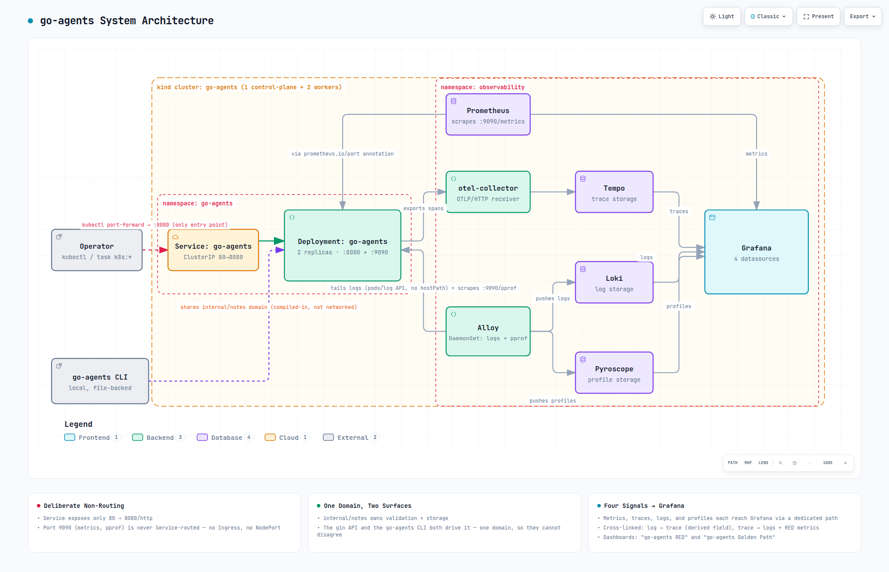
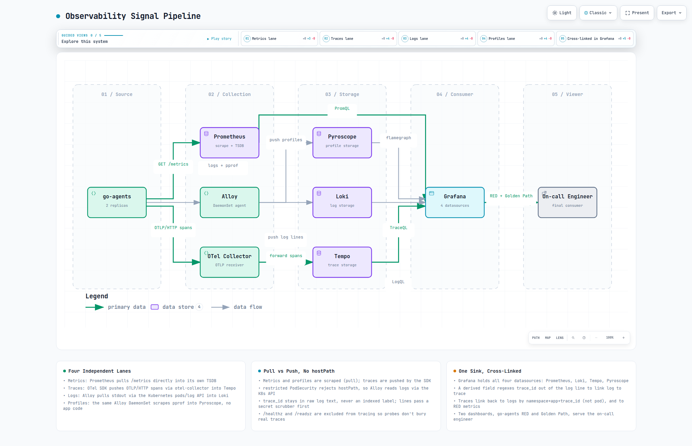
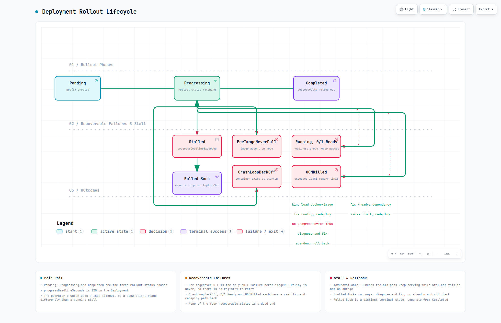
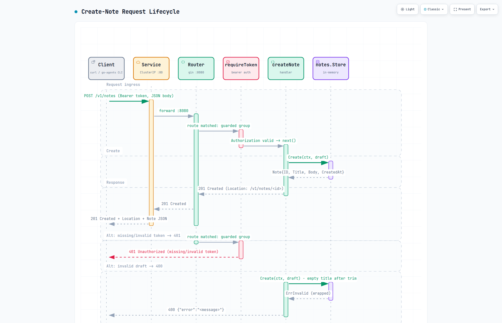
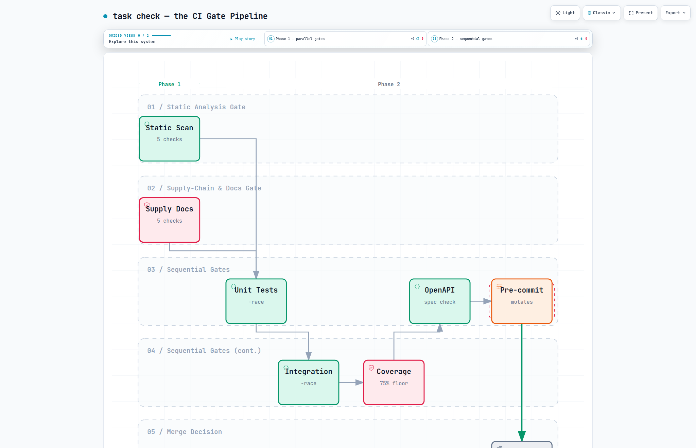

# Diagrams

Five views of this system, each generated from the actual code, manifests and
`Taskfile.yml` — not hand-drawn, and not aspirational. Every fact in every
diagram below was verified against this repository before being diagrammed:
route definitions in `internal/api/api.go`, middleware order in
`cmd/server/main.go`, gate structure in `Taskfile.yml`'s `check:` task,
Kubernetes topology in `infrastructure/local/k8s/`, and the observability
wiring in `infrastructure/local/observability/`.

These are static renders. Each was built as a self-contained, interactive
HTML page (pan/zoom, search, theme switching, relationship tracing) — but
that page runs to roughly 700KB, over this repo's
[512KB tracked-file ceiling](../AGENTS.md#rules), so the interactive version
is not committed here. Ask for it directly if you want to explore one.

## System architecture

The kind cluster (`go-agents`, one control-plane and two worker nodes), the
`go-agents` namespace (Service on :80, Deployment on 2 replicas with the app's
:8080 HTTP port and :9090 admin port — the Service deliberately does not
route :9090), and the `observability` namespace (Prometheus, Tempo,
otel-collector, the Alloy DaemonSet, Loki, Pyroscope and Grafana). The
`internal/notes` domain is driven by two surfaces — this API and a separate
local `go-agents` CLI — so the two cannot disagree about a business rule.

## Observability signal pipeline

Four independent telemetry lanes from one application, each with its own
collection mechanism, converging on Grafana: metrics (Prometheus pulls
`:9090/metrics`), traces (the app pushes OTLP/HTTP spans to otel-collector,
which forwards to Tempo), logs (Alloy tails container logs through the
Kubernetes `pods/log` API — not hostPath, which the `observability`
namespace's `restricted` PodSecurity standard rejects at admission — and
pushes to Loki), and profiles (Alloy scrapes the same admin port's
`/debug/pprof` and pushes to Pyroscope, with no application code required).
Grafana cross-links all four: a log line's derived field jumps to its trace,
and a trace's `tracesToLogsV2` jumps back to its logs, matched on
namespace + app + trace id.

## Deployment rollout lifecycle

The state machine behind `kubectl rollout status deployment/go-agents`:
Pending → Progressing → Completed on the main rail, with four recoverable
failure states branching off Progressing — `ErrImageNeverPull` (the only pull
failure possible here, since `imagePullPolicy: Never` means there is no
registry to retry against), `CrashLoopBackOff`, `Running` but `0/1 READY`, and
`OOMKilled` — each with a real transition back to Progressing once fixed.
Stalled (`progressDeadlineExceeded` after 120s) forks two ways: diagnose and
fix, or abandon and roll back. `maxUnavailable: 0` is why Stalled is
survivable rather than an outage — the old pods keep serving the whole time.

## Create-note request sequence

`POST /v1/notes` end to end: gin's middleware chain in its real order
(`Recovery` → tracing → RED metrics → request logger), the bearer-token check
that guards only the mutating routes, JSON binding, and the domain's own
validation — with the two failure branches (missing/invalid token → 401,
invalid draft → 400) shown as real alternate paths, not just prose.

## `task check` gate pipeline

The actual merge gate, not a description of it: ten read-only checks running
in genuine parallel (lint, fmt, vet, gosec, gitleaks, large-files, govulncheck,
docs-parity, the manifests check, and the promtool alert-rule tests), then
five steps that must run strictly in sequence because they build, mutate, or
depend on what came before — ending with the pre-commit hooks last and only
last, because two of them (`trailing-whitespace`, `end-of-file-fixer`)
rewrite files in place and would otherwise race the read-only gates above.
